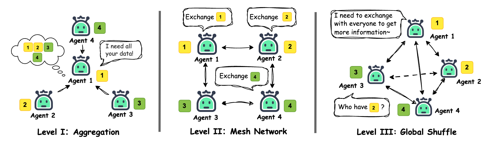
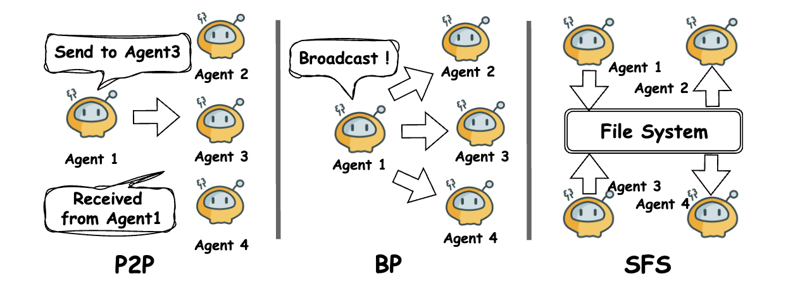
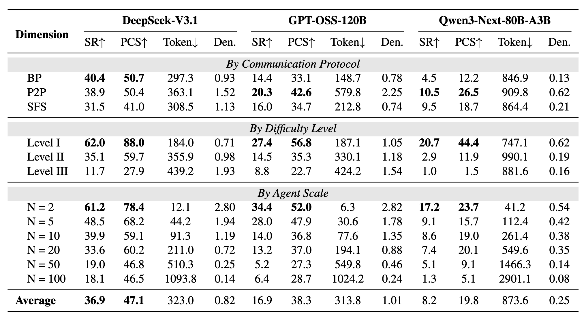
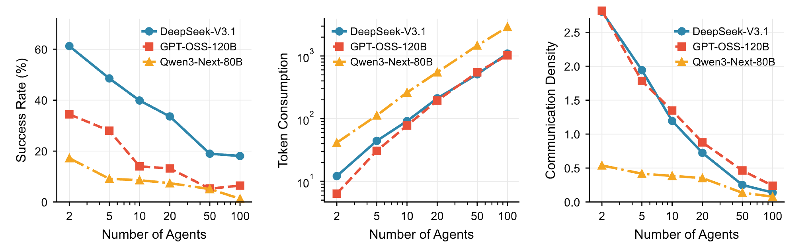
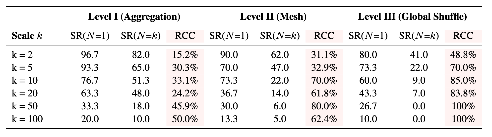

<h1 align="center">🏝️ SILO-BENCH</h1>

<p align="center">
  <strong>A Scalable Environment for Evaluating Distributed Coordination in Multi-Agent LLM Systems</strong>
</p>

<p align="center">
  <a href="https://arxiv.org/abs/2603.01045"></a>
  <a href="LICENSE"></a>
  <a href="https://www.python.org/downloads/"></a>
</p>

<p align="center">
  <em>Role-free benchmark for multi-agent LLM collaboration under information silos.</em><br>
  Each agent holds only a private data shard and must autonomously discover communication strategies, coordinate, and converge on correct answers — no pre-assigned roles.
</p>

---

## 🔥 Overview

**SILO-BENCH** is a role-agnostic, configurable environment for evaluating distributed coordination under information silos. Unlike static test suites that prescribe fixed roles and communication scripts, our framework dynamically generates unlimited evaluation instances while providing high-level task-structural guidance.

### Key Findings: Communication-Reasoning Gap

Our experiments expose a fundamental **Communication-Reasoning Gap** in current LLMs:

> 🔍 **Agents spontaneously form task-appropriate coordination topologies and exchange information actively, yet systematically fail to synthesize distributed state into correct answers.**

The failure is localized to the reasoning-integration stage—agents often acquire sufficient information but cannot integrate it. This coordination overhead compounds with scale, eventually eliminating parallelization gains entirely.

### Experimental Setup

| Dimension | Configuration |
|-----------|---------------|
| **Tasks** | 30 (10 per difficulty level) |
| **Agent Scales** | 2, 5, 10, 20, 50, 100 |
| **Protocols** | P2P, Broadcast (BP), Shared File System (SFS) |
| **Total Configurations** | 6 × 3 × 3 = 54 unique settings |

---

## 📊 Benchmark Design

### Three Complexity Levels

Tasks are organized into three levels based on their optimal communication complexity:

<p align="center">
  
</p>
<p align="center"><em>Figure: Three complexity levels characterized by their communication patterns</em></p>

| Level | Name | Complexity | Description | Optimal Topology |
|-------|------|------------|-------------|------------------|
| **I** | Aggregation | O(N) | Independent local processing + simple aggregation | Star or Tree |
| **II** | Mesh Network | O(N) | Spatial locality, boundary exchange with neighbors | Linear Chain |
| **III** | Global Shuffle | O(N log N) to O(N²) | Complex dependencies, global communication | Full Mesh |

### Three Communication Protocols

<p align="center">
  
</p>
<p align="center"><em>Figure: The three communication protocols employed in SILO-BENCH</em></p>

| Protocol | Tools | Description |
|----------|-------|-------------|
| **P2P** (`msg`) | `send_message`, `receive_messages`, `wait`, `submit_result` | Directed messaging to individual recipients |
| **Broadcast** (`broadcast`) | `broadcast_message`, `receive_messages`, `list_agents`, `wait`, `submit_result` | Messages reach all agents simultaneously |
| **SFS** (`sfs`) | `list_files`, `read_file`, `write_file`, `delete_file`, `wait`, `submit_result` | Indirect coordination through shared file system |

> **Note:** All protocols use round-based synchronization: messages/files written in round *t* become visible in round *t+1*.

### Evaluation Metrics

We define four complementary metrics to capture both *what* agents achieve and *how* they coordinate:

| Metric | Formula | Description |
|--------|---------|-------------|
| **Success Rate (S)** | $\mathcal{S} = \frac{1}{N}\sum_{i=1}^{N}\mathbb{1}[\hat{y}_i = y^*]$ | Proportion of agents converging to correct answer |
| **Partial Correctness (P)** | $\mathcal{P} = \frac{1}{N}\sum_{i=1}^{N}q_i$ | Continuous measure of answer quality (task-category tailored) |
| **Token Consumption (C)** | $\mathcal{C} = \frac{\sum_{i=1}^{N}\sum_{r=1}^{R}t_i^{out}[r]}{R_{max}}$ | Computational cost per communication round |
| **Communication Density (D)** | $\mathcal{D} = \frac{\sum_{i=1}^{N}m_i}{N(N-1)}$ | Inter-agent interaction intensity |

> Together, **S** and **P** measure *what* agents achieve, **C** measures *at what cost*, and **D** reveals *how* they coordinate.

---

## 📈 Experimental Results

### Overall Performance

<p align="center">
  
</p>
<p align="center"><em>Figure: Overall performance across different models and protocols</em></p>

### Scaling Behavior

<p align="center">
  
</p>
<p align="center"><em>Figure: Scaling behavior across different agent counts</em></p>

### Single-Agent Baseline

<p align="center">
  
</p>
<p align="center"><em>Figure: Single-agent baseline comparison revealing the Communication-Reasoning Gap</em></p>

---

## 🚀 Quick Start

### Installation

```bash
# Requires Python 3.13+ and uv
uv sync
```

### Configuration

**Priority**: Environment variables > profile in config.yaml > default in config.yaml

```bash
# Option 1: Copy and edit config file
cp configs/config.example.yaml configs/config.yaml

# Option 2: Set environment variables
export SILO_API_BASE="https://api.openai.com/v1"
export SILO_API_KEY="your-key-here"
export SILO_MODEL="gpt-4o"
```

| Env Variable | Description |
|--------------|-------------|
| `SILO_API_BASE` | API base URL |
| `SILO_API_KEY` | API key |
| `SILO_MODEL` | Model name |

### Run Experiments

```bash
# Run a single experiment
uv run python -m src.batch_run \
    --task-dir benchmarks \
    --levels I \
    --agent-counts 2 \
    --protocols msg \
    --max-rounds 20 \
    --workspace workspace

# Run full matrix via helper script
./run.sh --profile default --workers 4
```

### CLI Arguments

| Argument | Default | Description |
|----------|---------|-------------|
| `--task-dir` | `benchmarks` | Task JSON directory |
| `--protocols` | `msg` | `msg`, `broadcast`, `sfs` |
| `--levels` | all | `I`, `II`, `III` |
| `--agent-counts` | all | Filter by agent count |
| `--models` | from config | Model(s) to evaluate |
| `--profile` | `default` | Config profile name |
| `--max-rounds` | `100` | Max rounds per case |
| `--workspace` | `workspace` | Output directory |
| `--workers` | `1` | Parallel workers |

### Analyze Results

```bash
uv sync --extra analysis
uv run python -m src.analyze workspace/
```

---

## 📁 Project Structure

```
silo-bench/
├── benchmarks/              # Pre-generated benchmark files (180 tasks)
│   ├── I-01_n2.json        # Level I tasks
│   ├── II-11_n5.json       # Level II tasks
│   └── III-21_n10.json     # Level III tasks
├── benchmark_generator/     # Benchmark generation scripts
├── src/
│   ├── engine.py           # Core execution engine
│   ├── models.py           # Data models (Pydantic)
│   ├── msg/                # P2P protocol implementation
│   ├── broadcast/          # Broadcast protocol implementation
│   ├── sfs/                # Shared File System protocol
│   └── utils/
│       ├── llm.py          # LLM API wrapper
│       ├── metrics.py      # Evaluation metrics (S, P, C, D)
│       └── prompts.py      # Protocol-specific system prompts
├── configs/
│   └── config.example.yaml # Example configuration
├── run.sh                  # Batch run helper script
└── pyproject.toml          # Project dependencies
```

---

## 📚 Task Overview

### Level I: Aggregation (I-01 to I-10)

Tasks with embarrassingly parallel computations and simple aggregation:

| Task | Name | Description |
|------|------|-------------|
| I-01 | Global Max | Find maximum value across all data |
| I-02 | Word Frequency | Count occurrences of target word |
| I-03 | Distributed Vote | Find candidate with most votes |
| I-04 | Any Match | Check if any string contains "ERROR" |
| I-05 | Range Count | Count numbers in range [L, R] |
| I-06 | Checksum | Compute XOR checksum |
| I-07 | Average Value | Compute global average |
| I-08 | Set Union Size | Count distinct elements |
| I-09 | Top-K Select | Find K largest elements |
| I-10 | Standard Deviation | Two-phase std dev computation |

### Level II: Mesh Network (II-11 to II-20)

Tasks with spatial locality requiring neighbor communication:

| Task | Name | Description |
|------|------|-------------|
| II-11 | Prefix Sum | Cumulative sum (segmented output) |
| II-12 | Moving Average | Window=3 moving average |
| II-13 | Longest Palindrome | Cross-boundary palindrome detection |
| II-14 | 1D Life Game | Cellular automaton simulation (segmented) |
| II-15 | Pattern Search | State machine across boundaries |
| II-16 | Trapping Rain | Bidirectional height propagation |
| II-17 | Diff Array | Compute differences |
| II-18 | List Ranking | Distributed linked list ranking |
| II-19 | Merge Neighbors | Boundary deduplication |
| II-20 | Pipeline Hash | Blockchain-style sequential hash (segmented) |

### Level III: Global Shuffle (III-21 to III-30)

Tasks requiring global communication and data shuffling:

| Task | Name | Description |
|------|------|-------------|
| III-21 | Distributed Sort | Global data redistribution (segmented) |
| III-22 | Median of Medians | Iterative convergence to median |
| III-23 | Graph Components | Distributed union-find |
| III-24 | BFS Distance | Multi-hop message propagation |
| III-25 | K-Means Iteration | Clustering coordination |
| III-26 | Global Distinct | Hash-based deduplication |
| III-27 | Collaborative Filtering | All-pairs scoring |
| III-28 | PageRank Step | Graph value propagation |
| III-29 | Load Balance | Deterministic greedy redistribution |
| III-30 | Matrix Multiply | Distributed linear algebra |

---

## 📖 Citation

If you find this work useful, please cite our paper:

```bibtex
@misc{zhang2026silobenchscalableenvironmentevaluating,
      title={Silo-Bench: A Scalable Environment for Evaluating Distributed Coordination in Multi-Agent LLM Systems},
      author={Yuzhe Zhang and Feiran Liu and Yi Shan and Xinyi Huang and Xin Yang and Yueqi Zhu and Xuxin Cheng and Cao Liu and Ke Zeng and Terry Jingchen Zhang and Wenyuan Jiang},
      year={2026},
      eprint={2603.01045},
      archivePrefix={arXiv},
      primaryClass={cs.MA},
      url={https://arxiv.org/abs/2603.01045},
}
```

---

## 📄 License

This project is released under the [Unlicense](LICENSE) - dedicated to the public domain.

---

<p align="center">
  <em>Built with ❤️ for advancing multi-agent LLM research</em>
</p>
